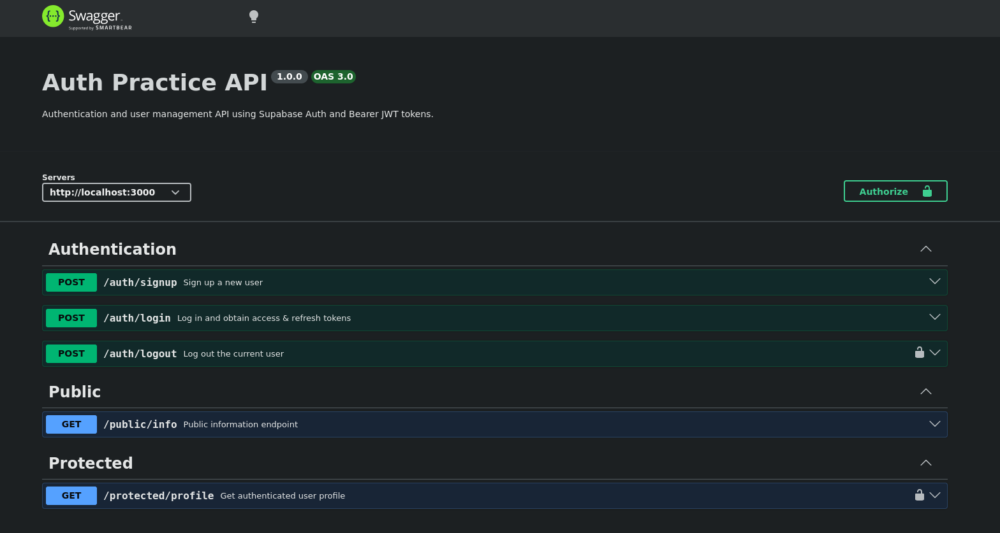
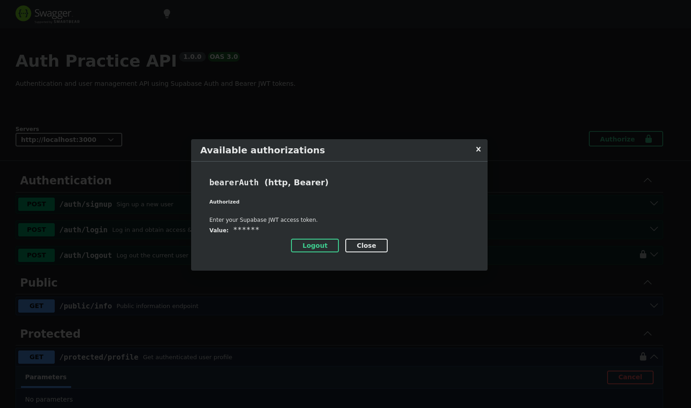
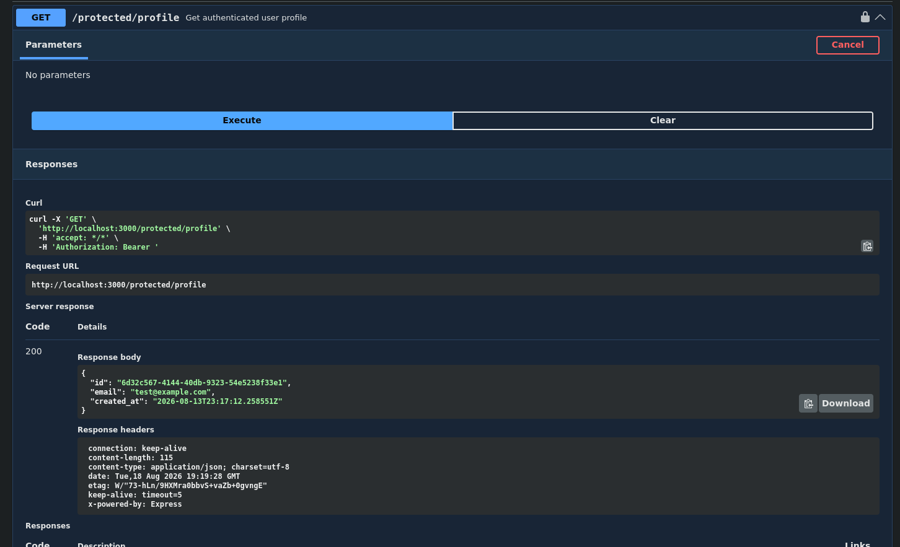

# Auth Practice

A full authentication and token verification REST API built with **Node.js**, **Express.js**, and **Supabase Auth**. This project serves as a clean starting template for any backend application requiring secure user authentication, token issuance, and protected routes guarded by middleware.

Interactive API documentation and authorization testing are provided via built-in **Swagger UI**.

---

## Features

* User registration (Sign Up) and session login


* Session revocation (Logout)


* Stateless JWT issuance and server-side verification using Supabase Auth


* Reusable Express middleware for protecting private endpoints


* OpenAPI 3.0 specification with interactive Swagger UI support (Bearer Token padlock)


---

## Tech Stack

* **Runtime:** Node.js (v20+ recommended)


* **Framework:** Express.js


* **Identity Provider (IdP):** Supabase Auth (`@supabase/supabase-js`)


* **Documentation:** Swagger UI Express & OpenAPI 3.0


---

## Getting Started

### Prerequisites

* [Node.js](https://nodejs.org/) (version 20 or newer recommended)


* `npm` (packaged with Node.js)
* A free [Supabase](https://supabase.com) account and project


---

### Installation & Setup

1. **Clone the repository:**
```bash
git clone https://github.com/Yizuz02/Auth-Practice.git
cd Auth-Practice
```


2. **Install dependencies:**
```bash
npm install
```


3. **Configure Environment Variables:**
The project includes a template file `.env.example` defining all required configuration variables. Create your local `.env` file from the template:


```bash
cp .env.example .env
```


Open `.env` and fill in your Supabase credentials found in **Supabase Dashboard → Project Settings → API**:


```env
PORT=3000
SUPABASE_URL=https://your-project-url.supabase.co
SUPABASE_KEY=your_supabase_anon_key
```


> **Note:** The `.env` file is git-ignored to ensure credentials are never exposed.
> 
> 


---

### Running the Application

Start the server using the configured npm scripts:

* **Production / Standard Mode:**
```bash
npm start
```


* **Development Mode (with auto-reload):**
```bash
npm run dev
```


The server runs by default on:

```
http://localhost:3000
```

---

## API Endpoints

| Method | Endpoint | Description | Auth Required |
| --- | --- | --- | --- |
| `POST` | `/auth/signup` | Registers a new user account with email and password.| No |
| `POST` | `/auth/login` | Authenticates credentials and returns an `access_token` (JWT) and `refresh_token`.| No|
| `POST` | `/auth/logout` | Terminates the current authenticated user session.| **Yes** (`Bearer <token>`)|
| `GET` | `/public/info` | Open public information endpoint accessible to anyone.| No|
| `GET` | `/protected/profile` | Returns the profile data of the currently authenticated user.| **Yes** (`Bearer <token>`)|

---

## Swagger Documentation

The API includes built-in interactive documentation powered by Swagger UI and OpenAPI 3.0. It allows developers to explore all routes, schemas, request/response models, and test protected endpoints directly in the browser using the **Authorize** padlock button.

Access Swagger UI at:

```
http://localhost:3000/docs
```

### General View of Docs



### Testing an Endpoint with Authorization

To test the protected endpoints directly from Swagger UI:

1. Click the green **Authorize** (padlock) button at the top right of the page.
2. Paste a valid Supabase JWT `access_token` into the input field and confirm. If the token is valid, Swagger UI will confirm your authenticated session as shown below:



3. Once authorized, you can execute requests against any protected endpoint (such as `GET /protected/profile` or `POST /auth/logout`) using the **Try it out** button:




## Internship

This project was developed as part of the **FlyRank AI Internship** (Backend Development Track).

